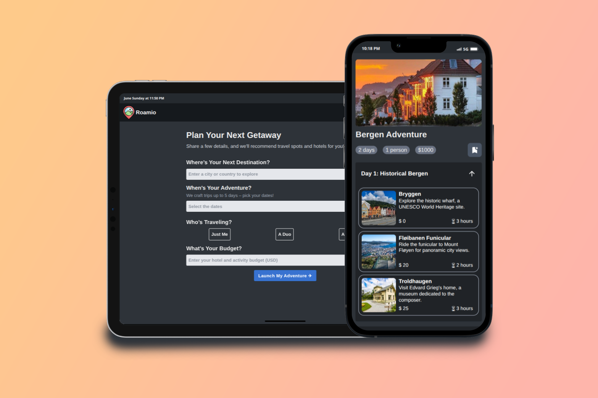
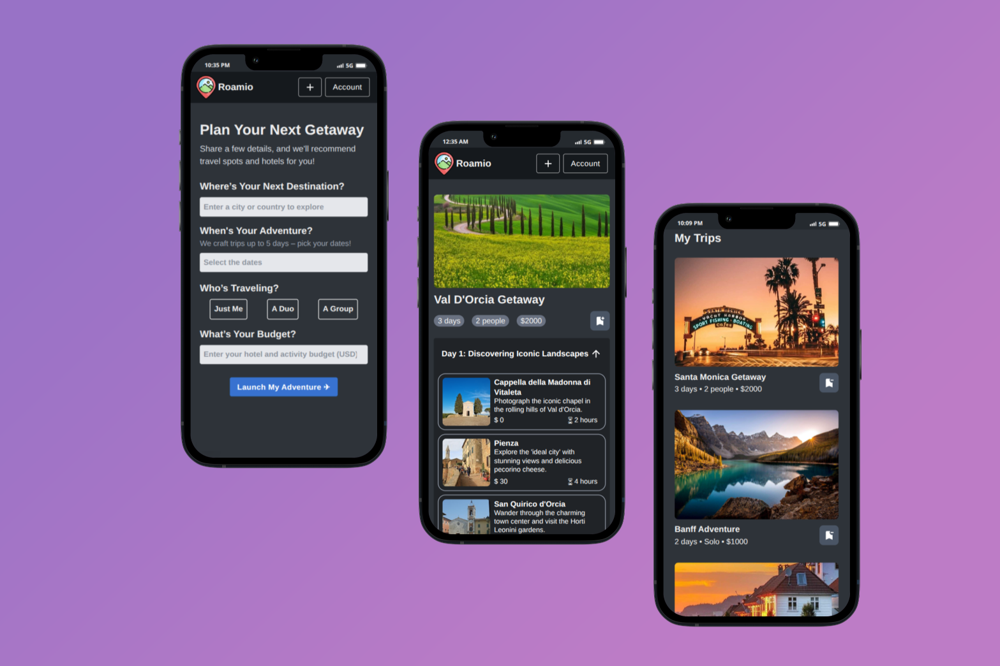
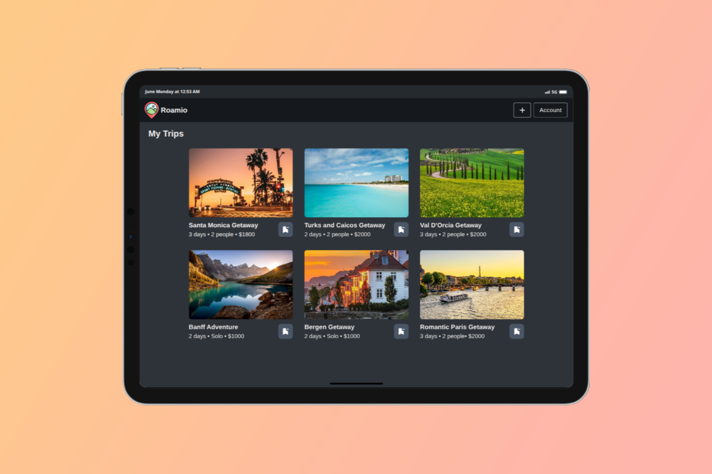

# Roamio Travel Planner

A modern web application for planning and managing your travel plans. Built with React, Next.js, TypeScript, and Supabase.

  

  

  

[<u><font size="3">Live Link &#x2708;</font></u>](https://roamio-travel-planner.vercel.app/)

## Tech Stack

- **Frontend:** React, Next.js, TypeScript
- **Backend:** Supabase (Auth + Database)
- **APIs:** Google Place, Google Gemini
- **UI:** TailwindCSS, Material-UI

## Features

- Secure login/signup with Supabase
- Local and cloud data sync
- AI-powered travel suggestions including location and hotel recommendations
- Responsive design for all devices

## What I Learned

- Implemented user authentication and managed data with Supabase
- Integrated Google Place & Gemini APIs
- Secured API keys using Next.js Server Components
- Managed state with React Context

## Getting Started

1. Clone the repository:

```bash
git clone https://github.com/mluc404/travel-planner.git
```

2. Navigate to the project directory:

```bash
cd travel-planner
```

3. Install dependencies:

```bash
npm install
```

4. Start the development server:

```bash
npm run dev
```
